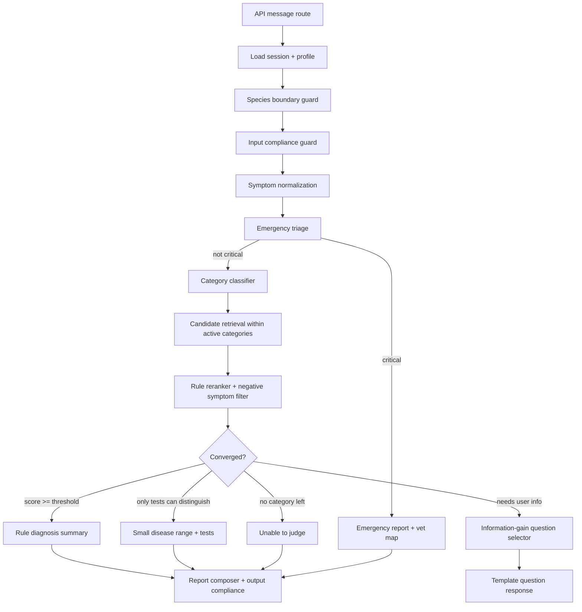

# Rule-Driven Consultation Graph Implementation Plan

> **For agentic workers:** REQUIRED SUB-SKILL: Use superpowers:subagent-driven-development (recommended) or superpowers:executing-plans to implement this plan task-by-task. Steps use checkbox (`- [ ]`) syntax for tracking.

**Goal:** Rebuild the current pet consultation flow into a rule-driven, explainable differential pre-diagnosis system with configurable scoring, information-gain follow-up selection, strict species isolation, and low-confidence refusal/check recommendations.

**Architecture:** Keep the existing Next.js + TypeScript project and replace the monolithic custom pipeline with a typed consultation graph. Core decisions stay in deterministic rule modules; the LLM is limited to symptom normalization, wording polish, and fallback summaries when allowed.

**Tech Stack:** Next.js 16, TypeScript, Vitest, JSON knowledge base, optional `@langchain/langgraph` only if the team chooses a formal graph runtime.

---

## Reality Check From The Current Repository

The supplied document assumes an existing Python + LangGraph project. The actual repository is different:

- Runtime: Next.js + TypeScript, not Python.
- Current orchestrator: `src/agent/pipeline.ts`.
- Current state machine: `src/store/session.ts`.
- Current RAG/retrieval: `src/knowledge/retriever.ts`, `src/agent/differential-router.ts`.
- Current adaptive interview: `src/agent/interviewer.ts`.
- Current diagnosis/reporting: `src/agent/diagnostician.ts`, `src/agent/confidence.ts`, `src/agent/reporter.ts`.
- No `langgraph`, `@langchain/langgraph`, or `langchain` dependency exists in `package.json`.

Recommendation: do not migrate to Python. If LangGraph is desired, use the JavaScript package `@langchain/langgraph` later. The safer first step is to create a local typed graph runner interface in TypeScript, then optionally swap the runner to LangGraph after behavior is stable.

## Target Blueprint



## File Structure To Create Or Modify

- Create `src/agent/consultation-state.ts`
  - Owns the single typed state object passed between graph nodes.
  - Tracks `confirmedSymptoms`, `deniedSymptoms`, `unknownSymptoms`, `activeCategories`, `screenedCategories`, `candidatePool`, `roundsUsed`, and `decisionTrace`.

- Create `src/agent/consultation-config.ts`
  - Loads all tunable thresholds and weights from JSON.
  - Exposes `getConsultationConfig(species)`.

- Create `data/consultation/config.json`
  - Stores category weights, candidate thresholds, convergence thresholds, max rounds by risk level, negative symptom penalties, and output confidence threshold.

- Create `data/consultation/question-templates.json`
  - Maps standard symptoms and risk factors to fixed owner-facing questions.

- Create `src/agent/category-classifier.ts`
  - Replaces hardcoded category rules in `differential-router.ts`.
  - Uses positive symptoms, denied symptoms, age, vaccine status, sex/neuter status, and exposure history.

- Create `src/agent/candidate-ranker.ts`
  - Centralizes disease scoring.
  - Replaces duplicated scoring spread across `retriever.ts`, `differential-router.ts`, `interviewer.ts`, and `confidence.ts`.

- Create `src/agent/question-selector.ts`
  - Calculates information gain across remaining candidates.
  - Selects the next best observable question using templates.

- Create `src/agent/convergence.ts`
  - Owns all convergence decisions:
    - single disease high confidence
    - 2-3 disease range requiring hospital tests
    - category backtracking
    - unable to judge
    - max round reached

- Create `src/agent/consultation-graph.ts`
  - Encapsulates the orchestration as named nodes.
  - Can initially be a deterministic in-process graph; optional later migration to `@langchain/langgraph`.

- Modify `src/agent/pipeline.ts`
  - Reduce to an adapter that builds graph state, invokes `runConsultationGraph`, saves session, and returns API output.

- Modify `src/store/types.ts`
  - Add persistent consultation state fields to `SessionContext`.

- Modify `src/knowledge/types.ts`
  - Add normalized fields required by the scoring engine if missing: `coreSigns`, `majorSigns`, `minorSigns`, `negativeExclusions`, `testOnlyDifferentials`.

- Modify `src/agent/diagnostician.ts`
  - Stop using LLM as a diagnostic decision maker for KB-backed flows.
  - Keep it only for wording or fallback summaries, with source clearly marked.

## Phase 1: Lock Current Behavior With Regression Tests

**Files:**
- Create: `src/agent/__tests__/consultation-graph-regression.test.ts`
- Modify: none

- [ ] **Step 1: Add regression tests for the five document acceptance cases**

Cover:

```ts
it('directly triggers emergency for dog eating rat poison with seizures', async () => {})
it('directly returns high-confidence CPV for unvaccinated puppy with tomato foul bloody diarrhea', async () => {})
it('downranks vomiting-core diseases when cat diarrhea explicitly denies vomiting and mental depression', async () => {})
it('backtracks from digestive category to parasite category when digestive candidates are ruled out', async () => {})
it('returns a small disease range and hospital tests when only lab tests can distinguish candidates', async () => {})
```

- [ ] **Step 2: Run tests and record current failures**

Run:

```powershell
npm test -- src/agent/__tests__/consultation-graph-regression.test.ts --reporter=dot
```

Expected: failures that describe current gaps.

## Phase 2: Introduce Persistent Consultation State

**Files:**
- Create: `src/agent/consultation-state.ts`
- Modify: `src/store/types.ts`
- Test: `src/agent/__tests__/consultation-state.test.ts`

- [ ] **Step 1: Define state shape**

Required fields:

```ts
export interface ConsultationState {
  sessionId: string
  petId: string
  species: '犬' | '猫'
  rawTurns: string[]
  confirmedSymptoms: string[]
  deniedSymptoms: string[]
  unknownSymptoms: string[]
  activeCategories: string[]
  screenedCategories: string[]
  candidatePool: RankedDiseaseCandidate[]
  pendingQuestions: PendingQuestion[]
  roundsUsed: number
  maxRounds: number
  decisionTrace: DecisionTraceItem[]
}
```

- [ ] **Step 2: Persist it through `SessionContext`**

Add `consultationState?: ConsultationState` to `src/store/types.ts`.

- [ ] **Step 3: Add tests for state merge**

Verify:
- New positive symptom is added once.
- Negated symptom overrides previous positive symptom only when the latest turn clearly denies it.
- Species cannot change inside an active state.

## Phase 3: Move All Tunable Weights To Config

**Files:**
- Create: `data/consultation/config.json`
- Create: `src/agent/consultation-config.ts`
- Modify: `src/agent/differential-router.ts`
- Modify: `src/agent/reporter.ts`
- Test: `src/agent/__tests__/consultation-config.test.ts`

- [ ] **Step 1: Add config**

Minimum schema:

```json
{
  "categoryThreshold": 1,
  "candidate": {
    "categoryHit": 28,
    "primarySymptomHit": 12,
    "secondarySymptomHit": 4,
    "coreKeySymptomHit": 12,
    "majorKeySymptomHit": 8,
    "minorKeySymptomHit": 4,
    "riskCoreHit": 12,
    "riskMajorHit": 8,
    "negativeCorePenalty": 35,
    "negativePrimaryPenalty": 22,
    "negativeSecondaryPenalty": 12,
    "unrelatedPenalty": 42
  },
  "convergence": {
    "highConfidenceScore": 90,
    "minimumReportConfidence": 65,
    "categoryBacktrackScore": 60,
    "clearLeadGap": 18,
    "testOnlyCandidateLimit": 3
  },
  "rounds": {
    "emergency": 2,
    "commonMild": 3,
    "complex": 5
  }
}
```

- [ ] **Step 2: Replace hardcoded values**

Start with values in:
- `scoreCandidateCoherence()`
- `recomputeScores()`
- `shouldRequireFollowup()`
- `MIN_REPORTABLE_CONFIDENCE`

## Phase 4: Replace Category Routing With A Configurable Classifier

**Files:**
- Create: `src/agent/category-classifier.ts`
- Create: `src/agent/__tests__/category-classifier.test.ts`
- Modify: `src/agent/differential-router.ts`

- [ ] **Step 1: Implement category scoring**

Inputs:
- confirmed symptoms
- denied symptoms
- pet profile
- raw text

Outputs:
- ordered category candidates
- reason trace

Rules:
- diarrhea routes to digestive, infectious, parasitic, toxicology.
- unvaccinated juvenile boosts infectious.
- female intact with systemic signs adds reproductive.
- explicit toxin exposure boosts toxicology.
- denied defining signs reduce category score.

## Phase 5: Centralize Candidate Ranking

**Files:**
- Create: `src/agent/candidate-ranker.ts`
- Create: `src/agent/__tests__/candidate-ranker.test.ts`
- Modify: `src/knowledge/retriever.ts`
- Modify: `src/agent/differential-router.ts`
- Modify: `src/agent/interviewer.ts`
- Modify: `src/agent/confidence.ts`

- [ ] **Step 1: Add the single ranking formula**

Use the document formula as the baseline, then map existing structured fields:

```text
score =
  coreSymptomsHit * 2
  + keySignsHit * 3
  + secondarySymptomsHit * 0.5
  + riskFactorsHit
  - missingCoreSymptoms * 1.5
  - negativeCoreSymptomsHit * 3
  - unrelatedSymptomPenalty
```

Scale to 0-100 for current UI compatibility.

- [ ] **Step 2: Add rule trace**

Every candidate must expose:

```ts
{
  disease: string,
  score: number,
  matchedCore: string[],
  matchedSecondary: string[],
  matchedRisks: string[],
  deniedCore: string[],
  missingCore: string[],
  reason: string
}
```

## Phase 6: Information-Gain Question Selection

**Files:**
- Create: `src/agent/question-selector.ts`
- Create: `data/consultation/question-templates.json`
- Create: `src/agent/__tests__/question-selector.test.ts`
- Modify: `src/agent/interviewer.ts`

- [ ] **Step 1: Calculate information gain**

For each unasked observable symptom:

```ts
gain = Math.min(candidateCountWithSymptom, candidateCountWithoutSymptom)
```

Priority tie-break:

1. Owner-observable symptom
2. Simple measurable value
3. Hospital-only test

- [ ] **Step 2: Stop asking hospital-only questions**

If the remaining differentiators are only `bloodwork`, `PCR`, `ultrasound`, `X-ray`, `CT`, or `biochemistry`, stop asking and return a small disease range plus tests.

## Phase 7: Graph-Oriented Orchestration

**Files:**
- Create: `src/agent/consultation-graph.ts`
- Create: `src/agent/__tests__/consultation-graph.test.ts`
- Modify: `src/agent/pipeline.ts`

- [ ] **Step 1: Create graph nodes**

Nodes:
- `speciesGuardNode`
- `inputGuardNode`
- `normalizeNode`
- `triageNode`
- `categoryNode`
- `retrieveNode`
- `rankNode`
- `convergenceNode`
- `questionNode`
- `reportNode`
- `emergencyNode`

- [ ] **Step 2: Keep pipeline as adapter**

`runPipeline()` should:
1. load profile
2. create or hydrate graph state
3. call `runConsultationGraph(state)`
4. save state into session
5. return `PipelineOutput`

## Phase 8: Restrict LLM To Non-Decisional Work

**Files:**
- Modify: `src/agent/diagnostician.ts`
- Modify: `src/knowledge/keyword-transformer.ts`
- Modify: `src/models/client.ts`
- Test: `src/agent/__tests__/diagnostician.test.ts`

- [ ] **Step 1: KB-backed flows skip LLM diagnosis**

When candidate ranking produces candidates, build raw diagnoses from ranked KB entries, not from the LLM.

- [ ] **Step 2: LLM fallback is clearly capped**

When no KB match exists:
- perform web search if enabled
- cap confidence at 60
- force `template_4` or small-range output unless emergency

## Phase 9: Evaluation Harness

**Files:**
- Create: `data/evaluation/pet-consultation-cases.json`
- Create: `scripts/evaluate-consultation.ts`
- Create: `src/agent/__tests__/evaluation-smoke.test.ts`

- [ ] **Step 1: Add labeled cases**

At minimum:
- 50 dog cases
- 50 cat cases
- balanced by digestive, urinary, respiratory, skin, infectious, parasite, toxicology, reproductive, emergency

- [ ] **Step 2: Track metrics**

Output:
- Top1 accuracy
- Top3 recall
- emergency sensitivity
- average follow-up rounds
- low-confidence refusal rate
- species-boundary violations

## Execution Order

1. Phase 1 regression tests.
2. Phase 2 persistent state.
3. Phase 3 config extraction.
4. Phase 4 category classifier.
5. Phase 5 central ranker.
6. Phase 6 information-gain questions.
7. Phase 7 graph orchestration.
8. Phase 8 LLM restriction.
9. Phase 9 evaluation harness.

## Acceptance Criteria

- Existing tests remain green.
- New document acceptance cases pass.
- Cat and dog never cross diagnostic chains.
- No formal diagnosis output below configured confidence threshold.
- Repeated questions are eliminated by state.
- Remaining 2-3 test-only diseases produce inspection recommendations instead of more user questions.
- Core diagnosis decision can be explained from rule traces without reading LLM output.

